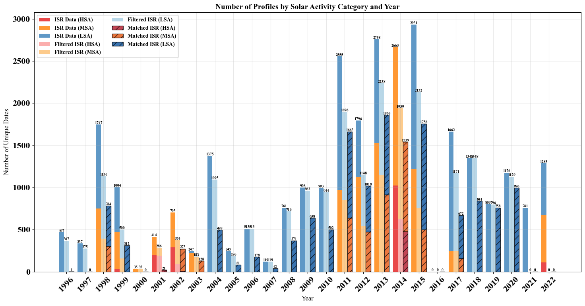
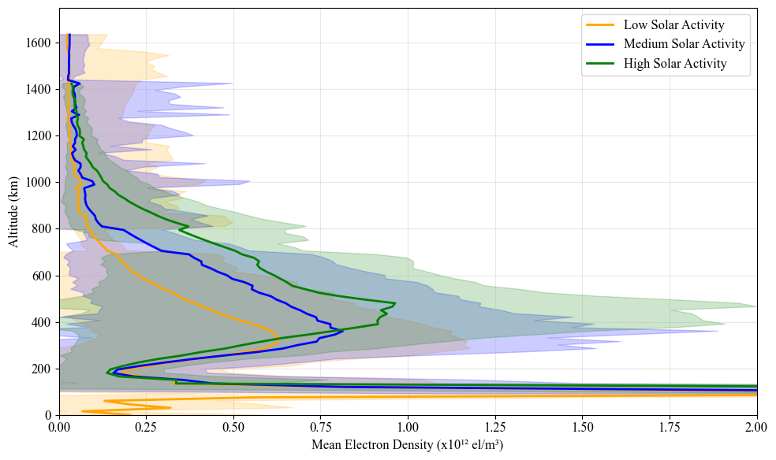
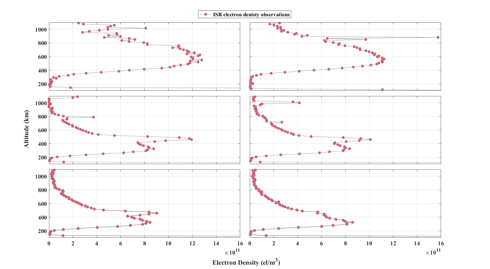
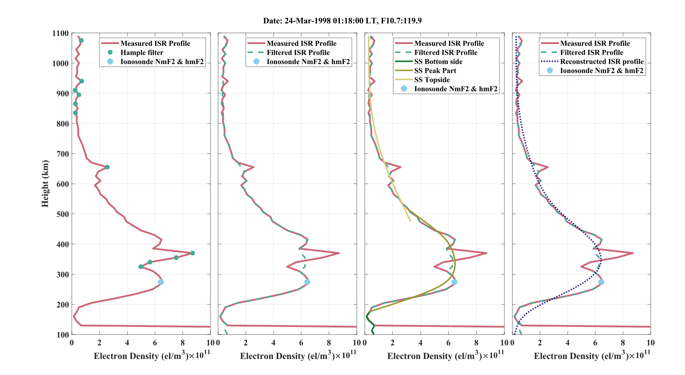
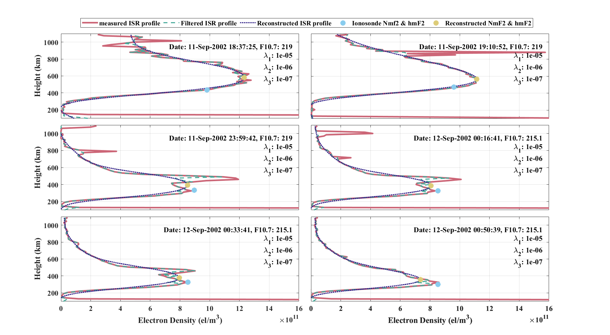
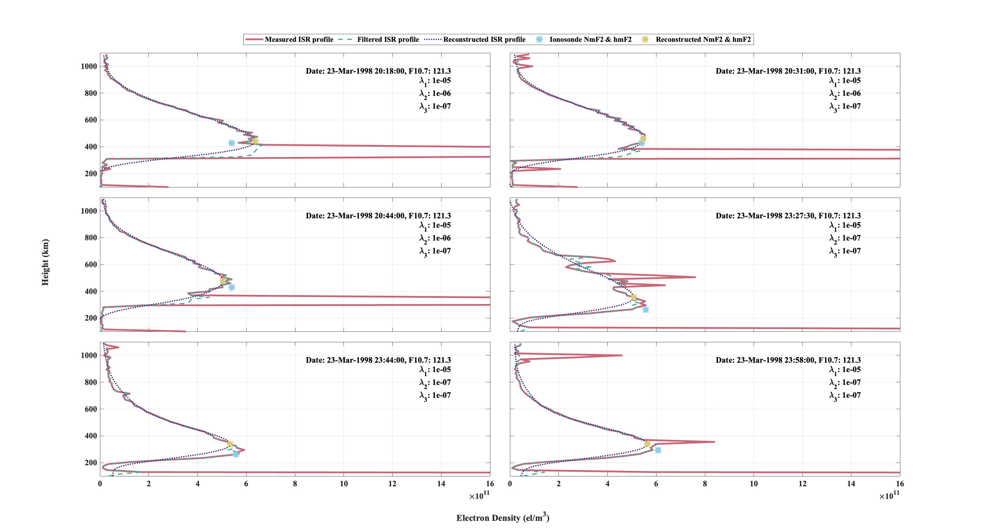
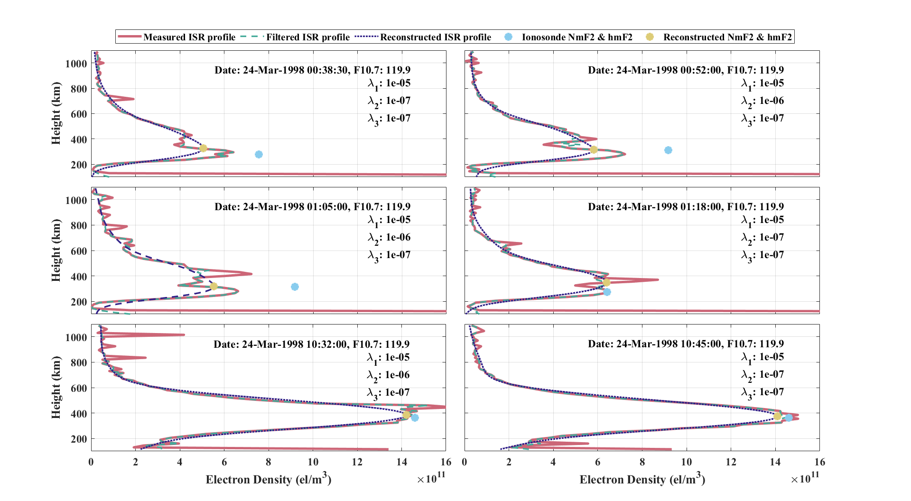
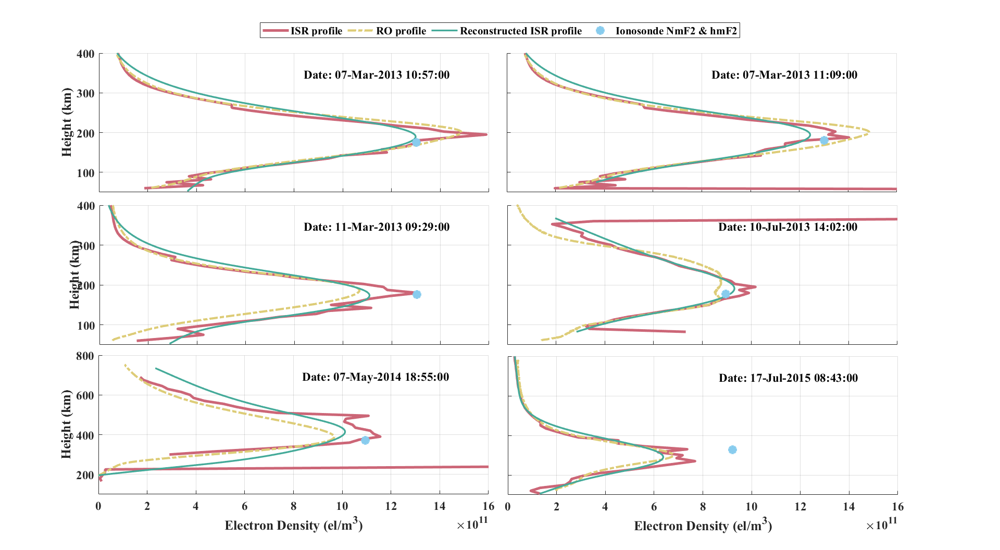

# An Efficient Mathematical Approach for the Reconstruction of Incoherent Scatter Radar Electron Density Profiles

[](https://www.python.org/)
[](https://numpy.org/)
[](https://scipy.org/)
[](https://pandas.pydata.org/)
[](https://matplotlib.org/)
[](https://en.wikipedia.org/wiki/Median_absolute_deviation)
[](https://docs.scipy.org/doc/scipy/reference/interpolate.html)
[](https://www.igp.gob.pe/observatorios/radio-observatorio-jicamarca/)
[](https://cdaac-www.cosmic.ucar.edu/)
[](LICENSE)

This repository presents a mathematical reconstruction workflow for **Incoherent Scatter Radar (ISR) Electron Density Profiles (EDPs)** measured over the Jicamarca Radio Observatory. The main objective is to reconstruct corrupted, incomplete, noisy, or highly fluctuating ISR profiles using a combination of **Hampel filtering**, **piecewise smoothing splines**, and validation against **ionosonde** and **Radio Occultation (RO)** measurements.

---

## Project Overview

Electron Density Profiles are essential for studying ionospheric behavior and supporting applications in space weather, radio propagation, satellite communication, and ionospheric modeling. ISR systems provide high-resolution ground-based measurements, but the raw profiles may contain noise, missing values, unrealistic spikes, or strong fluctuations.

This project develops a reconstruction pipeline that transforms noisy ISR measurements into smooth, physically interpretable electron density profiles.

The workflow answers a practical question:

> **Can a corrupted ISR electron density profile be reconstructed into a reliable full vertical profile while preserving its main ionospheric structure?**

---

## Research Scenario

The dataset consists of ISR electron density profiles collected from the **Jicamarca Radio Observatory** over a long observational period. These profiles cover different solar activity conditions and show diverse ionospheric behavior.

The project scenario follows these steps:

1. **Collect ISR electron density profiles**
   - Profiles are obtained from Jicamarca ISR observations.
   - Each profile represents electron density variation with altitude.

2. **Clean incomplete profiles**
   - Profiles with excessive missing values are removed.
   - Profiles with acceptable missing values are filled using a moving-window median approach.

3. **Remove geomagnetic disturbance cases**
   - Disturbed geomagnetic periods are excluded using the DST index.
   - This helps reduce the influence of geomagnetic storms on the reconstruction process.

4. **Classify profiles by solar activity**
   - The F10.7 solar flux index is used to classify the profiles into:
     - Low Solar Activity (LSA)
     - Medium Solar Activity (MSA)
     - High Solar Activity (HSA)

5. **Filter outliers using the Hampel filter**
   - Local spikes and unrealistic fluctuations are detected.
   - Outlier points are replaced using local median behavior.

6. **Divide the profile into physical regions**
   - Bottomside
   - Peak region
   - Topside

7. **Reconstruct each region using smoothing splines**
   - Each part is reconstructed with a suitable smoothing parameter.
   - The parts are then combined into a complete reconstructed EDP.

8. **Validate reconstructed profiles**
   - Peak parameters are compared with ionosonde NmF2 and hmF2.
   - Full profiles are compared with collocated Radio Occultation profiles.

---

## Methodology

### 1. Data Availability and Solar Activity Classification

The dataset contains ISR profiles from multiple years and solar activity levels. The profiles are grouped using F10.7 solar flux values into low, medium, and high solar activity categories.



---

### 2. Mean Electron Density Profiles

The mean electron density profile is computed for each solar activity category. This provides a broad view of how the ionosphere behaves under different solar activity conditions.



---

### 3. Initial ISR Profile Observations

Raw ISR observations may include missing points, abnormal spikes, or irregular fluctuations. These issues make direct interpretation difficult and can prevent reliable extraction of peak parameters such as NmF2 and hmF2.



---

### 4. Hampel Filtering

The Hampel filter is used to identify and reduce local outliers. It compares each value with the median behavior of nearby observations. If a point deviates strongly from its local neighborhood, it is replaced by a more stable local median value.

This step creates a cleaner background profile before spline reconstruction.

---

### 5. Piecewise Profile Reconstruction

Instead of reconstructing the whole profile at once, the EDP is divided into three parts:

- **Bottomside:** lower-altitude portion below the F2 peak
- **Peak region:** region surrounding NmF2 and hmF2
- **Topside:** upper-altitude portion above the F2 peak

Each part is reconstructed separately because each region behaves differently and requires a different level of smoothing.



---

### 6. Smoothing Spline Reconstruction

Smoothing splines are used to estimate a continuous electron density curve from the filtered ISR profile. The method balances two goals:

- staying close to the measured ISR data,
- reducing unrealistic fluctuations and producing a smooth profile.

The reconstructed profile is then used to estimate a complete EDP and its peak parameters.

---

## Reconstruction Examples

### High Solar Activity

The model reconstructs ISR profiles during high solar activity periods. These profiles may include strong fluctuations and sharp changes near the peak region.



---

### Medium Solar Activity

Medium solar activity profiles often require careful control of the filtering window and smoothing parameters, especially when strong local fluctuations appear near the peak or topside.



---

### Low Solar Activity

Low solar activity profiles show how the method adapts to quieter ionospheric conditions while still handling noise and profile irregularities.



---

## Validation Using Radio Occultation Profiles

The reconstructed ISR profiles are validated against collocated Radio Occultation profiles. This comparison evaluates whether the reconstructed profile follows the expected full-profile structure.



---

## Main Outputs

The project produces:

- cleaned ISR electron density profiles,
- Hampel-filtered profiles,
- reconstructed bottomside, peak, and topside sections,
- complete reconstructed ISR profiles,
- estimated NmF2 and hmF2 values,
- solar activity-based profile comparisons,
- validation plots using ionosonde and RO measurements,
- annual profile availability summaries,
- mean electron density behavior by solar activity level.

---


## Model Concept

The model reconstructs an electron density profile through a structured mathematical pipeline:

```text
Raw ISR Profile
      │
      ▼
Missing Value Handling
      │
      ▼
Geomagnetic Disturbance Filtering
      │
      ▼
Solar Activity Classification
      │
      ▼
Hampel Outlier Filtering
      │
      ▼
Profile Division
Bottomside | Peak Region | Topside
      │
      ▼
Smoothing Spline Reconstruction
      │
      ▼
Full Reconstructed ISR Electron Density Profile
      │
      ▼
Validation with Ionosonde and RO Data
```

---

## Results Summary

The reconstruction results show that smoothing splines can recover the general structure of ISR electron density profiles under low, medium, and high solar activity conditions.

The model performs especially well when the corrupted profile still preserves enough structural information around the F2 peak and bottomside. In cases with strong topside fluctuations, the smoothing parameter becomes important because it controls how closely the reconstructed curve follows the noisy measured data.

The reconstructed NmF2 and hmF2 values are visually close to the corresponding ionosonde measurements in many examples. The Radio Occultation validation also shows that the reconstructed profiles can follow the full-profile shape when ISR and RO observations are reasonably aligned.

---

## Scientific Significance

This project provides a practical mathematical framework for improving the reliability of ISR-derived electron density profiles. Instead of discarding noisy or partially corrupted ISR observations, the workflow reconstructs them into smoother and more usable profiles.

The approach may support:

- ionospheric monitoring,
- local empirical ionospheric model development,
- ISR data quality improvement,
- recovery of incomplete electron density profiles,
- comparison with ionosonde and satellite-based RO measurements,
- long-term studies of ionospheric variability over Jicamarca.

---

## Limitations

The reconstruction quality depends on the quality of the original ISR profile, the selected Hampel window size, and the smoothing parameters used for each profile section. Strongly corrupted profiles may still be difficult to reconstruct if the measured structure is too distorted or incomplete.

The validation with Radio Occultation is also limited by the availability of collocated RO measurements. Future improvements may require larger validation datasets and an automated parameter optimization strategy.

---

## Future Work

Possible future improvements include:

- optimizing the Hampel filter window size automatically,
- using an optimization algorithm to tune smoothing parameters,
- validating with additional Radio Occultation missions,
- extending the method to other ISR stations,
- adding uncertainty estimates for reconstructed profiles,
- comparing spline reconstruction with machine learning and deep learning approaches,
- building an interactive dashboard for ISR profile reconstruction and validation.

---

## License

This project is licensed under the MIT License — see the [LICENSE](LICENSE) file for details.

---

## Contact

**Manar Anwar**
📧 mabusirdaneh@outlook.com
🔗 [GitHub @MAK1406](https://github.com/MAK1406)

---

<p align="center"><em>If you find this work useful, please ⭐ the repo — it helps others discover it.</em></p>
